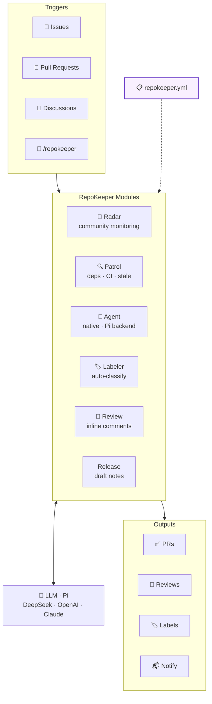

<p align="center">
  
</p>

# RepoKeeper

[](https://github.com/shenxianpeng/repokeeper/actions/workflows/ci.yml)
[](https://codecov.io/gh/shenxianpeng/repokeeper)
[](https://pypi.org/project/repokeeper/)
[](https://pypi.org/project/repokeeper/)
[](https://github.com/shenxianpeng/repokeeper)
[](https://shenxianpeng.github.io/repokeeper/)

**AI-powered open source maintainer agent. Reads issues, writes code, opens PRs — 24/7.**

```bash
# Label an issue agent-todo — RepoKeeper handles the rest
/repokeeper go
```

Zero config. GitHub-native. ~$0.01 per PR with DeepSeek.

---

## Why RepoKeeper?

Open source maintenance is a second job you didn't sign up for. GitHub
Copilot helps you write code in the editor, and its [Code Review](https://docs.github.com/en/copilot/using-github-copilot/code-review/using-copilot-code-review)
feature reviews PRs. [CodeRabbit](https://coderabbit.ai) and [PR-Agent (Qodo)](https://qodo.ai)
automate PR workflows with line-level suggestions and descriptions. But what
about **everything else**? Implementing issues, bumping dependencies,
diagnosing CI, monitoring your community, and iterating on fixes?

> **Copilot codes with you. CodeRabbit and PR-Agent review PRs. RepoKeeper runs your repo while you sleep.**

| | Copilot Code Review | CodeRabbit | PR-Agent (Qodo) | RepoKeeper |
|---|---|---|---|---|
| **Issue → PR** | No | No | No | Yes — native + Pi |
| **Conversational PR fix** | No | No | No | Yes — push to same branch |
| **Code review** | Yes — PR only | Yes — line-level | Yes — /review | Yes — inline + severity |
| **PR description generation** | No | Yes | Yes — /describe | Yes — /describe |
| **Draft release notes** | No | No | No | Yes — PRs + direct commits |
| **Auto-labeling** | No | Yes | Yes | Yes — 15 categories, diff-aware |
| **Dependency scanning** | No | No | No | Yes — 8 ecosystems |
| **CI diagnosis + fix** | No | No | No | Yes — auto-repair PRs |
| **CI monitoring (agent PRs)** | No | No | No | Yes — auto-fix on failure |
| **Community monitoring** | No | No | No | Yes — Radar (issues + discussions) |
| **Scheduled / cron** | No | No | No | Yes — daily patrol |
| **Multi-model** | GitHub models only | Multiple | Multiple | DeepSeek / OpenAI / Claude |
| **Backend options** | Single | Single | Single | Native + Pi agent loop |
| **Profile / config** | `.github/copilot-instructions.md` | `.coderabbit.yaml` | `.pr_agent.toml` | `repokeeper.yml` (one file) |
| **Interface** | GitHub.com, IDE | GitHub App, web | GitHub Action, CLI | GitHub Actions, CLI, labels, comments |
| **OSS cost** | Subscription required | Free for public repos | Free for public repos | Free (your own LLM key) |
| **Setup time** | Enable in settings | Install GitHub App | Copy Action + API key | Copy Action + API key |
| **Self-hosted** | No | No | Yes | Yes — one composite action, 7 modules |

## What It Does

- **🔭 Community Radar** — Monitors GitHub issues **and discussions** for keywords. AI classifies hits as bugs, feature requests, or noise. **Auto-creates issues** with deduplication and RepoKeeper branding, linking back to original discussions. Notifies via email, Telegram, or WeChat.
- **🔍 Daily Patrol** — Scans **8 ecosystems** (pip, npm, Go, Cargo, Bundler, Composer, Maven, Gradle) for outdated deps. Diagnoses CI failures with real job/step data. **Auto-fixes CI** by opening repair PRs. Finds stale issues. Health score every weekday morning.
- **🤖 Implementation Agent** — Reads your codebase + issue → implements → verifies (lint + tests) → pushes branch → opens PR. Supports **two backends**: native (single LLM call, ~$0.001) and **Pi** (autonomous agent loop, reads files, runs tests, self-corrects). **PR fix mode**: comment `/repokeeper go` on a PR with feedback → agent reads the conversation → pushes fixes to the same branch. **CI monitoring**: watches agent PRs for CI failures and auto-pushes fixes.
- **🔧 CI Monitor** — After the Implementation Agent opens a PR, monitors CI checks. **Diagnoses failures** using real job/step log data. **Auto-pushes fixes** to the same branch when CI breaks.
- **📝 Code Review Agent** — Reads PR diffs → checks against your profile → posts **inline line-level comments** with severity indicators and suggestion blocks. Incremental re-review on new commits. Auto-generates PR descriptions from diffs.
- **🏷️ Auto-Labeler** — AI classifies new issues and PRs, picks labels from your repo's existing set (matching naming conventions), and creates new labels only when needed — with consistent style and descriptions. Diff-aware PR classification.
- **Release Notes** — Drafts GitHub release notes from merged PRs, direct commits, labels, and changed files. Creates or updates draft releases only; publishing remains manual.
- **👤 Maintainer Profile** — One YAML file. Code style, tone, PR standards, tech stack preferences, skip keywords, verification commands. *Or skip it — defaults work.*

## Architecture



## Adopt in 60 Seconds

Three ways to onboard — pick one:

### 📋 Copy a workflow

Create `.github/workflows/repokeeper.yml` in your repo:

```yaml
name: RepoKeeper Implementation Agent

on:
  issue_comment:
    types: [created]
  issues:
    types: [labeled]
  pull_request_target:
    types: [labeled]

jobs:
  agent:
    runs-on: ubuntu-latest
    if: |
      (
        github.event_name == 'issue_comment' &&
        contains(github.event.comment.body, '/repokeeper go') &&
        (
          github.event.comment.author_association == 'OWNER' ||
          github.event.comment.author_association == 'MEMBER' ||
          github.event.comment.author_association == 'COLLABORATOR'
        )
      ) ||
      (
        github.event_name == 'issues' &&
        github.event.label.name == 'agent-todo'
      ) ||
      (
        github.event_name == 'pull_request_target' &&
        github.event.label.name == 'agent-fix'
      )
    permissions:
      contents: write
      issues: write
      pull-requests: write
    steps:
      - name: Determine context
        id: ctx
        shell: bash
        run: |
          if [ "${{ github.event_name }}" = "pull_request_target" ]; then
            echo "issue=${{ github.event.pull_request.number }}" >> "$GITHUB_OUTPUT"
            echo "pr=${{ github.event.pull_request.number }}" >> "$GITHUB_OUTPUT"
          elif [ "${{ github.event.issue.pull_request }}" != "" ]; then
            echo "issue=${{ github.event.issue.number }}" >> "$GITHUB_OUTPUT"
            echo "pr=${{ github.event.issue.number }}" >> "$GITHUB_OUTPUT"
          else
            echo "issue=${{ github.event.issue.number }}" >> "$GITHUB_OUTPUT"
            echo "pr=" >> "$GITHUB_OUTPUT"
          fi

      - uses: shenxianpeng/repokeeper@v1
        with:
          module: agent
          repo: ${{ github.repository }}
          issue: ${{ steps.ctx.outputs.issue }}
          pr: ${{ steps.ctx.outputs.pr }}
          llm_api_key: ${{ secrets.DEEPSEEK_API_KEY }}
          llm_base_url: ${{ secrets.LLM_BASE_URL || 'https://api.deepseek.com' }}
          github_token: ${{ secrets.REPOKEEPER_GITHUB_TOKEN || secrets.GITHUB_TOKEN }}
```

Then add your API key: **Settings → Secrets → Actions → New secret:** `DEEPSEEK_API_KEY` = `sk-...`

Before pushing, run the setup check:

```bash
repokeeper doctor --repo owner/repo
```

`doctor` verifies the profile, workflow triggers, workflow permissions, token
environment, LLM key, and repository slug. Fix anything marked `missing`, then
push the workflow.

> Want Radar, Patrol, Labeler, Review, and Release Notes too? Use the same `shenxianpeng/repokeeper@v1` action with `module: radar`, `module: patrol`, `module: labeler`, `module: review`, or `module: release` in separate workflow files.

### 🖥️ CLI

```bash
pip install repokeeper
repokeeper init --all-workflows   # profile + all 5 workflows
repokeeper init --minimal         # profile + agent workflow only
repokeeper doctor --repo owner/repo
```

### 🤖 Ask AI

Paste this into any AI coding agent (Copilot Chat, Claude Code, Cursor, Windsurf, pi, etc.):

> Add RepoKeeper to this repository. Create `.github/workflows/repokeeper.yml` that uses the `shenxianpeng/repokeeper@v1` composite action with `module: agent` — trigger on issue comments (`/repokeeper go`) and labels (`agent-todo`). Pass `DEEPSEEK_API_KEY` as the `llm_api_key` input. Then tell me to add a `DEEPSEEK_API_KEY` secret in GitHub Actions settings.

### Trigger the agent

- Label any issue `agent-todo` — or comment `/repokeeper go`.
- Label a PR `agent-fix` — or comment `/repokeeper go` with feedback on a PR.
- Comment `/repokeeper review` on a PR for inline code review.

---

## Install (optional CLI)

```bash
pip install repokeeper
```

```bash
repokeeper init             # Create a profile
repokeeper init --minimal   # Create a profile + agent workflow
repokeeper doctor --repo owner/repo
repokeeper radar --repo owner/repo
repokeeper patrol --repo owner/repo --summary
repokeeper agent --repo owner/repo --issue 42
repokeeper labeler --repo owner/repo --issue 42
repokeeper labeler --repo owner/repo --pr 42
repokeeper review --repo owner/repo --pr 42
repokeeper describe --repo owner/repo --pr 42
repokeeper release --repo owner/repo --dry-run
repokeeper ci-monitor --repo owner/repo
```

---

## Documentation

Full docs at **[shenxianpeng.github.io/repokeeper](https://shenxianpeng.github.io/repokeeper)**

| Guide | |
|---|---|
| [Quick Start](https://shenxianpeng.github.io/repokeeper/quick-start/) | 5-minute setup |
| [Release Consistency](https://shenxianpeng.github.io/repokeeper/release/) | Keep GitHub release, PyPI, docs, and action tags aligned |
| [GitHub Marketplace](https://shenxianpeng.github.io/repokeeper/marketplace/) | Listing copy and demo script |
| [Security](https://shenxianpeng.github.io/repokeeper/security/) | Permissions, tokens, and automation boundaries |
| [Dogfood Cases](https://shenxianpeng.github.io/repokeeper/dogfood/) | Public proof and learning log for RepoKeeper runs |
| [Community Radar](https://shenxianpeng.github.io/repokeeper/module-1-radar/) | Monitor your community |
| [Daily Patrol](https://shenxianpeng.github.io/repokeeper/module-2-patrol/) | Automated health checks |
| [Implementation Agent](https://shenxianpeng.github.io/repokeeper/module-3-agent/) | AI-powered PRs + CI monitoring |
| [Auto-Labeler](https://shenxianpeng.github.io/repokeeper/module-5-labeler/) | AI-powered issue & PR labeling |
| [Maintainer Profile](https://shenxianpeng.github.io/repokeeper/module-4-profile/) | Full config reference |
| [Code Review Agent](https://shenxianpeng.github.io/repokeeper/module-6-review/) | Inline review, PR descriptions, incremental re-review |
| [Release Notes](https://shenxianpeng.github.io/repokeeper/module-7-release/) | Draft releases from PRs and direct commits |
| [Benchmarks](https://shenxianpeng.github.io/repokeeper/benchmarks/) | Cost and performance estimates by scenario |

## Contributing

Contributions are welcome, especially documentation examples, setup diagnostics,
tests, and safety improvements. See [CONTRIBUTING.md](CONTRIBUTING.md) before
opening a pull request.

## Safety Model

RepoKeeper creates reviewable pull requests and inline code review comments;
it does not approve or merge for you. The default workflow limits write
access to branches, issue comments, and pull requests, and the agent blocks
edits under `.github/workflows/`. See the
[Security guide](https://shenxianpeng.github.io/repokeeper/security/) before
enabling it on sensitive repositories.

---

## License

MIT © [Xianpeng Shen](https://github.com/shenxianpeng)
