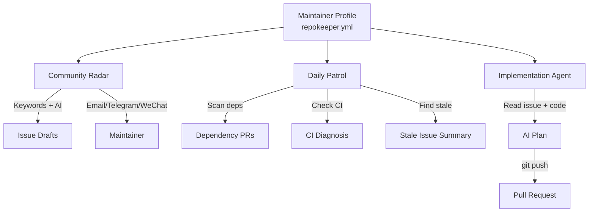

# RepoKeeper

**AI-powered open source maintainer agent.** RepoKeeper automates the
tedious parts of open source maintenance so you can focus on writing code.

## What RepoKeeper Does

| Module | What it does | Trigger |
|--------|-------------|---------|
| 🔭 **Community Radar** | Monitors GitHub for keywords, AI-classifies posts, drafts issues | Scheduled (every 3h) |
| 🔍 **Daily Patrol** | Checks dependencies, CI failures, stale issues, health score | Scheduled (daily 8am) |
| 🤖 **Implementation Agent** | Reads issues, implements code, opens PRs | `agent-todo` label or `@repokeeper go` |
| 👤 **Maintainer Profile** | YAML config for your style, tone, standards, and tech preferences | Core — used by all modules |

## How It Works



## Quick Start

### 1. Create a Profile

Create `repokeeper.yml` in your repo root:

```yaml
maintainer: your-github-username

radar:
  keywords:
    - bug
    - crash
    - security
    - feature request

patrol:
  schedule: "0 8 * * 1-5"

agent:
  model: deepseek-chat
```

### 2. Add GitHub Actions

Copy the workflows from `.github/workflows/` into your repo.

### 3. Set Secrets

| Secret | Required | Purpose |
|--------|----------|---------|
| `DEEPSEEK_API_KEY` | Yes | AI model API key |
| `GITHUB_TOKEN` | Auto | GitHub API access |
| `RKP_SMTP_USER` | No | Email notifications |
| `RKP_TELEGRAM_CHAT_ID` | No | Telegram notifications |

### 4. Trigger the Agent

Label an issue `agent-todo` or comment `@repokeeper go` on an issue.
RepoKeeper will read your codebase, devise a plan, and open a PR.

## Design Philosophy

- **Minimal & focused.** Each module does one thing well.
- **Profile-driven.** All behavior is configured via `repokeeper.yml`.
- **AI with safety.** Low-confidence results are filtered. Auto-merge is off by default.
- **Gradual adoption.** Enable modules one at a time. Start with Radar, then Patrol, then Agent.

## License

MIT
